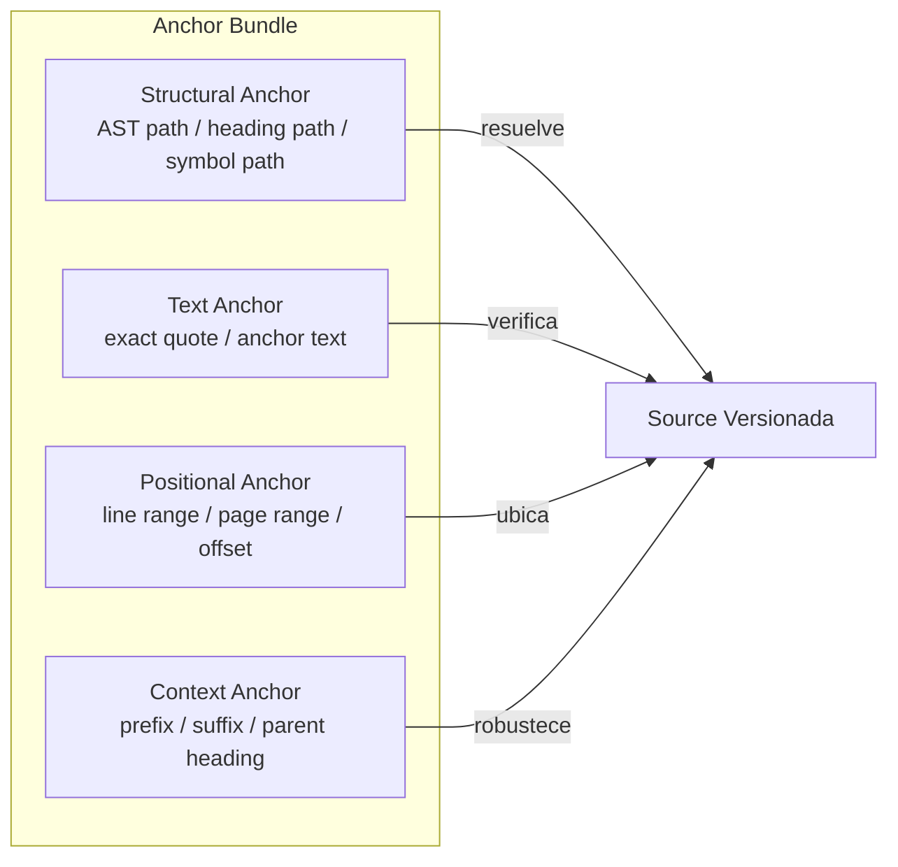

```mermaid
flowchart LR
    subgraph BUNDLE["Anchor Bundle"]
        STR_ANC[Structural Anchor<br/>AST path / heading path / symbol path]
        TXT_ANC[Text Anchor<br/>exact quote / anchor text]
        POS_ANC[Positional Anchor<br/>line range / page range / offset]
        CTX_ANC[Context Anchor<br/>prefix / suffix / parent heading]
    end

    SRC[Source Versionada]

    STR_ANC -->|resuelve| SRC
    TXT_ANC -->|verifica| SRC
    POS_ANC -->|ubica| SRC
    CTX_ANC -->|robustece| SRC
```
