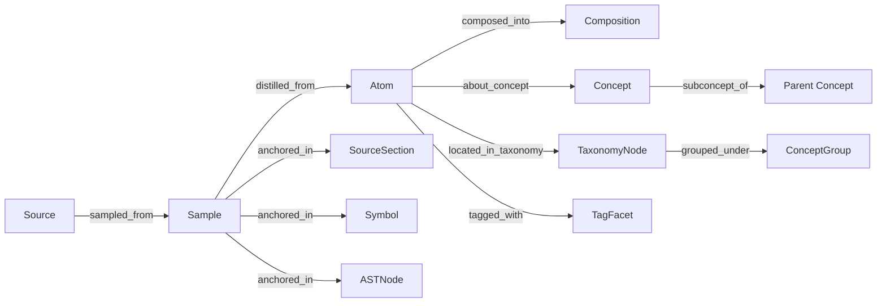

```mermaid
flowchart LR
    SRC[Source] -->|sampled_from| SAM[Sample]
    SAM -->|distilled_from| ATM[Atom]
    ATM -->|composed_into| CMP[Composition]

    SAM -->|anchored_in| SS[SourceSection]
    SAM -->|anchored_in| SYM[Symbol]
    SAM -->|anchored_in| AST[ASTNode]

    ATM -->|about_concept| CON[Concept]
    ATM -->|located_in_taxonomy| TN[TaxonomyNode]
    ATM -->|tagged_with| TF[TagFacet]

    TN -->|grouped_under| CG[ConceptGroup]
    CON -->|subconcept_of| CON2[Parent Concept]
```
