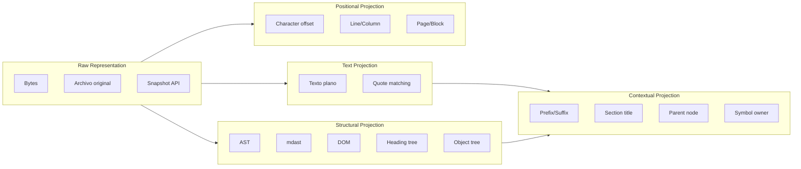

```mermaid
flowchart LR
    subgraph RAW["Raw Representation"]
        BYTE[Bytes]
        FILE[Archivo original]
        API[Snapshot API]
    end

    subgraph TXT["Text Projection"]
        PLT[Texto plano]
        QUOTE[Quote matching]
    end

    subgraph STRC["Structural Projection"]
        AST_[AST]
        MDAST[mdast]
        DOM[DOM]
        HEAD[Heading tree]
        OBJ[Object tree]
    end

    subgraph POS["Positional Projection"]
        OFF[Character offset]
        LC[Line/Column]
        PG[Page/Block]
    end

    subgraph CTX["Contextual Projection"]
        PRE[Prefix/Suffix]
        SEC[Section title]
        PRT[Parent node]
        SYM_[Symbol owner]
    end

    RAW --> TXT
    RAW --> STRC
    RAW --> POS
    TXT --> CTX
    STRC --> CTX
```
