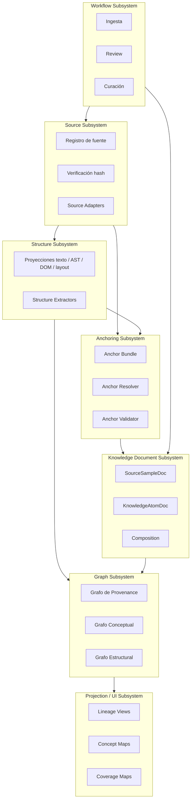

```mermaid
flowchart TB
    subgraph SRC["Source Subsystem"]
        SRC_ID[Registro de fuente]
        SRC_HASH[Verificación hash]
        SRC_ADAP[Source Adapters]
    end

    subgraph STR["Structure Subsystem"]
        PROJ[Proyecciones texto / AST / DOM / layout]
        EXTR[Structure Extractors]
    end

    subgraph ANC["Anchoring Subsystem"]
        ANC_BUNDLE[Anchor Bundle]
        ANC_RES[Anchor Resolver]
        ANC_VAL[Anchor Validator]
    end

    subgraph KNW["Knowledge Document Subsystem"]
        SAM_DOC[SourceSampleDoc]
        ATM_DOC[KnowledgeAtomDoc]
        CMP_DOC[Composition]
    end

    subgraph GRF["Graph Subsystem"]
        G_PRV[Grafo de Provenance]
        G_CON[Grafo Conceptual]
        G_STR[Grafo Estructural]
    end

    subgraph UI["Projection / UI Subsystem"]
        LINEAGE[Lineage Views]
        MAPS[Concept Maps]
        COV[Coverage Maps]
    end

    subgraph WKF["Workflow Subsystem"]
        ING[Ingesta]
        REV[Review]
        CUR[Curación]
    end

    SRC --> STR
    SRC --> ANC
    STR --> ANC
    STR --> GRF
    ANC --> KNW
    KNW --> GRF
    GRF --> UI
    WKF --> SRC
    WKF --> KNW
```
