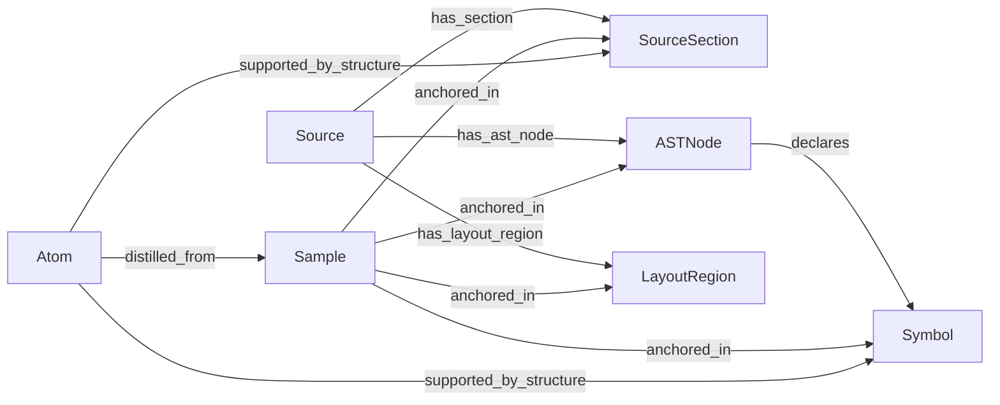

```mermaid
flowchart LR
    SRC[Source]
    SS[SourceSection]
    AST[ASTNode]
    SYM[Symbol]
    LR[LayoutRegion]
    SAM[Sample]
    ATM[Atom]

    SRC -->|has_section| SS
    SRC -->|has_ast_node| AST
    SRC -->|has_layout_region| LR
    AST -->|declares| SYM

    SAM -->|anchored_in| SS
    SAM -->|anchored_in| AST
    SAM -->|anchored_in| SYM
    SAM -->|anchored_in| LR

    ATM -->|distilled_from| SAM
    ATM -->|supported_by_structure| SS
    ATM -->|supported_by_structure| SYM
```
