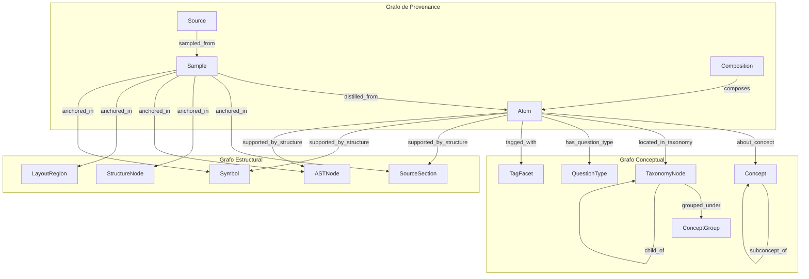

```mermaid
flowchart TB
    subgraph P["Grafo de Provenance"]
        SRC[Source]
        SAM[Sample]
        ATM[Atom]
        CMP[Composition]
    end

    subgraph C["Grafo Conceptual"]
        CON[Concept]
        CG[ConceptGroup]
        TN[TaxonomyNode]
        QT[QuestionType]
        TF[TagFacet]
    end

    subgraph S["Grafo Estructural"]
        SS[SourceSection]
        SYM[Symbol]
        SN[StructureNode]
        AST[ASTNode]
        LR[LayoutRegion]
    end

    SRC -->|sampled_from| SAM
    SAM -->|distilled_from| ATM
    CMP -->|composes| ATM

    ATM -->|about_concept| CON
    ATM -->|located_in_taxonomy| TN
    ATM -->|has_question_type| QT
    ATM -->|tagged_with| TF
    TN -->|grouped_under| CG
    TN -->|child_of| TN
    CON -->|subconcept_of| CON

    SAM -->|anchored_in| SS
    SAM -->|anchored_in| SN
    SAM -->|anchored_in| AST
    SAM -->|anchored_in| LR
    SAM -->|anchored_in| SYM

    ATM -->|supported_by_structure| SS
    ATM -->|supported_by_structure| SYM
    ATM -->|supported_by_structure| AST
```
