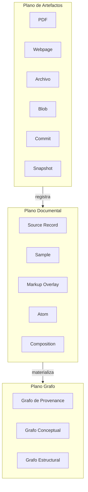

```mermaid
flowchart TB
    subgraph A["Plano de Artefactos"]
        PDF[PDF]
        WEB[Webpage]
        FILE[Archivo]
        BLOB[Blob]
        COMMIT[Commit]
        SNAP[Snapshot]
    end

    subgraph D["Plano Documental"]
        SR[Source Record]
        SAM[Sample]
        MO[Markup Overlay]
        ATM[Atom]
        CMP[Composition]
    end

    subgraph G["Plano Grafo"]
        PG[Grafo de Provenance]
        CG[Grafo Conceptual]
        SG[Grafo Estructural]
    end

    A -->|registra| D
    D -->|materializa| G
```
