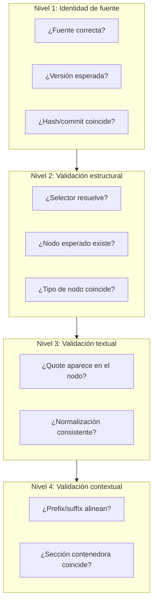

```mermaid
flowchart TB
    subgraph L1["Nivel 1: Identidad de fuente"]
        V1_1[¿Fuente correcta?]
        V1_2[¿Versión esperada?]
        V1_3[¿Hash/commit coincide?]
    end

    subgraph L2["Nivel 2: Validación estructural"]
        V2_1[¿Selector resuelve?]
        V2_2[¿Nodo esperado existe?]
        V2_3[¿Tipo de nodo coincide?]
    end

    subgraph L3["Nivel 3: Validación textual"]
        V3_1[¿Quote aparece en el nodo?]
        V3_2[¿Normalización consistente?]
    end

    subgraph L4["Nivel 4: Validación contextual"]
        V4_1[¿Prefix/suffix alinean?]
        V4_2[¿Sección contenedora coincide?]
    end

    L1 --> L2
    L2 --> L3
    L3 --> L4
```
