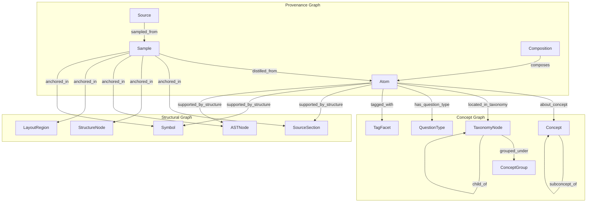
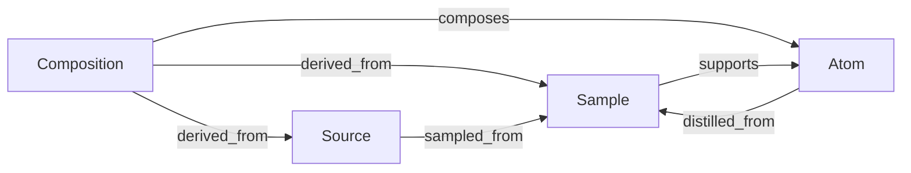
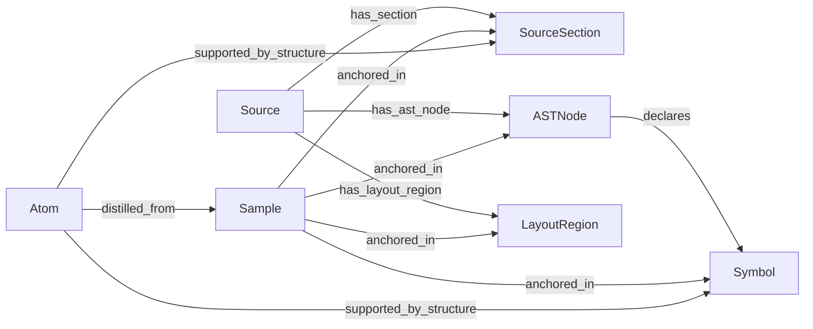
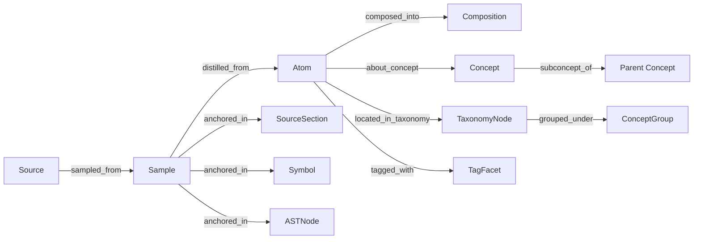

# Three-Graph Model Diagrams

## Estado
Draft

## Propósito
Materializar en Mermaid la arquitectura de tres grafos que emerge de:

- `/home/jp/Upla/source/spec/GRAPH_ARCHITECTURE.md`
- `/home/jp/Upla/source/spec/ATOM_CONCEPT_GRAPH.md`
- `/home/jp/Upla/source/spec/MULTI_SOURCE_ANCHORING.md`

Y que se apoya además en estas fuentes del repo `tutor_apoe`:

- `/home/jp/Upla/tutor_apoe/desk/atoms/tag-namespaces.yaml`
- `/home/jp/Upla/tutor_apoe/docs/diagrams/apos-atom-taxonomy.md`

---

## 1. Visión general

---

## 2. Provenance graph focused view

### Lectura

Este es el backbone descrito en:
- `/home/jp/Upla/source/spec/GRAPH_ARCHITECTURE.md`

La cadena principal sigue siendo:
- `Source -> Sample -> Atom -> Composition`

---

## 3. Concept graph focused view

```mermaid
flowchart TB
    CG1[Core Structures]
    CG2[Mechanisms]
    CG3[Research]
    CG4[Pedagogy]

    TN1[apos/core-structures/action]
    TN2[apos/mechanisms/encapsulation]
    TN3[apos/research/paradigm]
    TN4[apos/pedagogy/ace-cycle]

    C1[Action]
    C2[Encapsulation]
    C3[Research Paradigm]
    C4[ACE Cycle]

    A1[Atom: action is a core mental structure]
    A2[Atom: encapsulation treats a process as static entity]
    A3[Atom: APOS links theory methodology pedagogy as paradigm]
    A4[Atom: ACE cycle is main instructional pattern]

    QT1[what]
    QT2[what]
    QT3[what]
    QT4[what]

    TF1[topic:action]
    TF2[topic:encapsulation]
    TF3[layer:research]
    TF4[layer:pedagogy]

    TN1 -->|grouped_under| CG1
    TN2 -->|grouped_under| CG2
    TN3 -->|grouped_under| CG3
    TN4 -->|grouped_under| CG4

    A1 -->|about_concept| C1
    A2 -->|about_concept| C2
    A3 -->|about_concept| C3
    A4 -->|about_concept| C4

    A1 -->|located_in_taxonomy| TN1
    A2 -->|located_in_taxonomy| TN2
    A3 -->|located_in_taxonomy| TN3
    A4 -->|located_in_taxonomy| TN4

    A1 -->|has_question_type| QT1
    A2 -->|has_question_type| QT2
    A3 -->|has_question_type| QT3
    A4 -->|has_question_type| QT4

    A1 -->|tagged_with| TF1
    A2 -->|tagged_with| TF2
    A3 -->|tagged_with| TF3
    A4 -->|tagged_with| TF4
```

### Lectura

Este diagrama modela explícitamente algo que hoy aparece distribuido entre:

- `/home/jp/Upla/tutor_apoe/desk/atoms/tag-namespaces.yaml`
- `/home/jp/Upla/tutor_apoe/docs/diagrams/apos-atom-taxonomy.md`

La idea central es:
- los **tags** quedan como facets
- la **taxonomía** se vuelve estructura explícita del grafo
- el átomo se conecta a conceptos y a nodos taxonómicos de forma separada

---

## 4. Structural graph focused view

### Lectura

Este diagrama se apoya conceptualmente en:
- `/home/jp/Upla/source/spec/MULTI_SOURCE_ANCHORING.md`
- `/home/jp/proyectos/hum-ecosystem/tools/sldb/README.md` (AST-aware Markdown)
- `/home/jp/proyectos/hum-ecosystem/tools/marcado/README.md` (anchors, ranges, validation)

---

## 5. Bridging diagram

### Lectura

Este es probablemente el diagrama más cercano al comportamiento deseado del sistema:

- el sample conecta provenance con estructura
- el atom conecta provenance con concepto
- la composición conecta conceptos/átomos con vistas derivadas

---

## 6. Idea clave

La semántica del sistema no debe colapsarse en un solo grafo homogéneo.

Conviene distinguir:

1. **grafo de provenance**
2. **grafo conceptual**
3. **grafo estructural proyectado**

Y conviene además reconocer que:

- los tags no desaparecen
- pero dejan de ser la única o principal estructura semántica
- pasan a ser una superficie facetada sobre una estructura conceptual más rica
