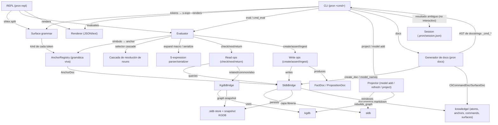
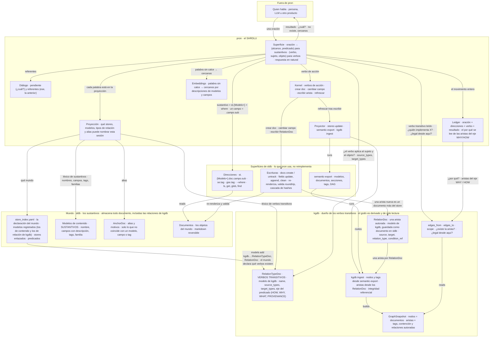
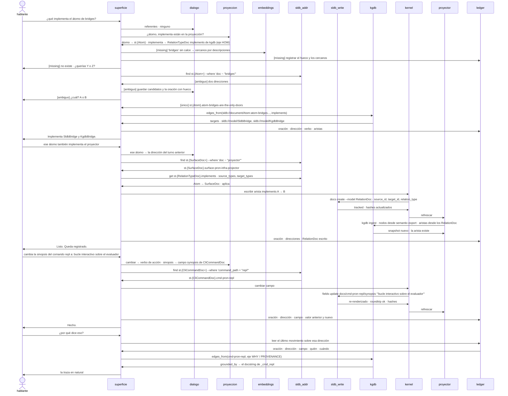
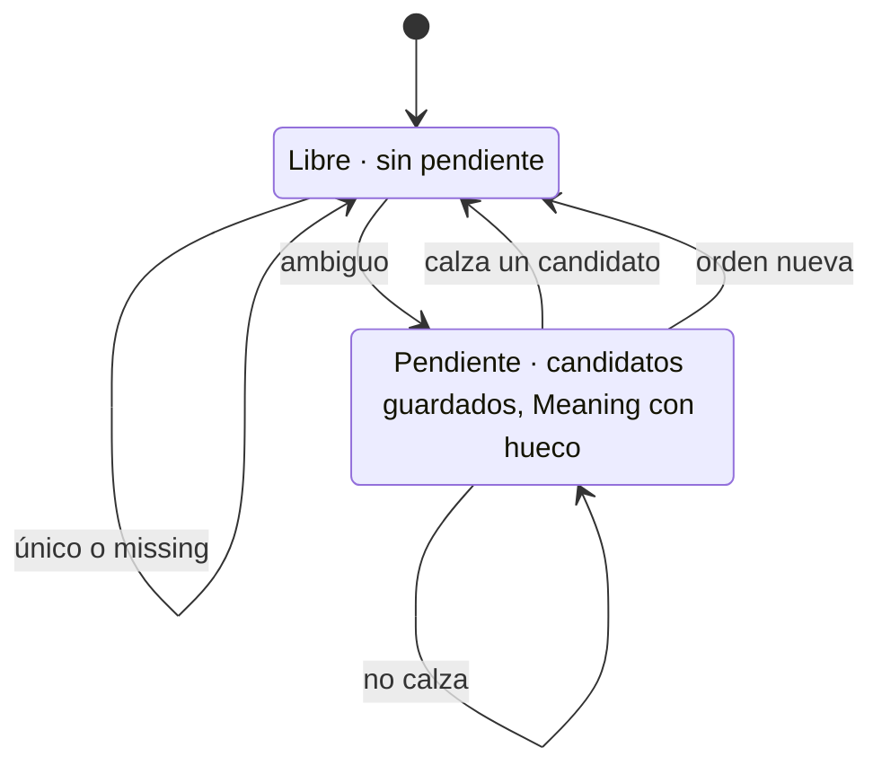

# Arquitectura de pron

Actual: derivado del código. Objetivo: un SHRDLU sobre el mundo que sldb y kgdb ya reparten — sustantivos por dirección en sldb, verbos transitivos como modelos de relación de kgdb almacenados en sldb y ensamblados por su ingest, verbos de acción como escrituras de sldb.

## Arquitectura actual

CLI/REPL sobre un kernel de Meaning (s-expresiones ancladas por gramática viva), operaciones que despachan a los bridges — la única puerta a sldb y kgdb — y un generador de docs que deriva del propio código.

- CLI y REPL comparten el mismo Evaluator; no hay una segunda gramática.
- Session (.pron/session.json) solo persiste la desambiguación del CLI no interactivo; el REPL la mantiene en memoria.
- Los bridges (SldbBridge, KgdbBridge) son la única puerta a las librerías sldb/kgdb, por atom-bridges-are-the-only-doors-to-sldb-and-kgdb.
- El generador de docs (pron docs) deriva CliCommandDoc de los docstrings de los handlers _cmd_* y SurfaceDoc del AST de cada módulo público.

## Objetivo · componentes

Pron pide por dirección, recorre aristas y escribe documentos. No resuelve, no filtra, no declara verbos. Los sustantivos son st.{Modelo+}.doc.campo más un predicado; los verbos transitivos son los modelos de relación de kgdb (RelationTypeDoc, RelationDoc), que sldb almacena como documentos y el ingest de kgdb ensambla; los verbos de acción son docs create, fields update y refrescar.

- El léxico sale de los modelos: nombre, campos con descripción, tags, familias ({Modelo+}). Los RelationTypeDoc dan los verbos transitivos con sus tipos válidos. Los AnchorDoc son alias, no la fuente.
- Un sustantivo es una dirección más un predicado, y eso lo responde sldb (ls, get, glob, find, --where). Pron no tiene cascada de resolución propia.
- Los modelos de relación son de kgdb: RelationTypeDoc declara el verbo con sus tipos válidos y su eje, RelationDoc es una arista autorada. Pron los registra en su store al declarar el mundo; sldb los guarda como documentos; el ingest de kgdb los vuelve aristas. kgdb sigue siendo derivado y de solo lectura.
- El ingest de kgdb tiene que tomar los RelationDoc además del semantic-export. Hoy assemble_authored_graph existe en kgdb pero no está en su CLI ni corre en el proyector de pron, por eso el grafo de pron no tiene ninguna arista de dominio.
- Una transición no se dispara en kgdb. Es una escritura en sldb, arista más campo de estado, seguida de un refresh que reensambla el grafo.
- El kernel son los verbos de acción y cada uno es una operación de sldb que ya existe: docs create, fields update y append, docs untrack, stores update.
- La declaración del mundo es store_index.yaml: modelos registrados, stores enlazados, predicados. La proyección es la parte de eso que una sesión puede nombrar.
- El por qué se lee de las aristas del eje WHY, HOW y PROVENANCE que los predicados del store le dan a cada verbo, más el ledger.
- Los sustantivos del mundo de pron son sus propios modelos: átomo, comando, superficie, anchor. Hoy los átomos están tipados con el AtomDoc de deskops y hay trece modelos de deskops registrados sin documentos; los dos salen, deskops es otra instancia sobre el núcleo, no la fuente de los modelos de pron.

## Objetivo · tres turnos

Tres oraciones, una por tipo de palabra. Un verbo transitivo leído (¿qué implementa X?), uno afirmado (X implementa Y, que se escribe como RelationDoc) y un verbo de acción (cambiar la sinopsis de un comando, que es un fields update). Las tres salidas del grounding se muestran sobre el primer turno.

- La superficie no resuelve el sustantivo: arma find st.{Modelo+} --where y sldb devuelve una dirección, dos (ambiguo) o ninguna (missing).
- Verificar que el verbo aplica es leer source_types y target_types del RelationTypeDoc, el modelo de kgdb, por dirección en sldb. Verificar que la arista existe o es legal desde aquí es kgdb.
- Afirmar un verbo transitivo es docs create de un RelationDoc, el modelo de relación de kgdb guardado en sldb. kgdb nunca recibe una orden; su ingest reensambla y la arista aparece.
- Un verbo de acción es una escritura de sldb: fields update re-renderiza el markdown, valida el roundtrip y actualiza la cascada de hashes.
- Missing consulta embeddings sobre las descripciones de modelos y campos, registra el hueco y termina el turno. Ambiguo abre una pendiente; la próxima oración entra como respuesta.
- El por qué combina el ledger (quién, cuándo, con qué oración) con las aristas del eje WHY y PROVENANCE.
- Todos los sustantivos son del mundo de pron: st.{Atom+} es su modelo de átomo, no el AtomDoc de deskops, y el comando es un CliCommandDoc de la KB de pron.

## Objetivo · el diálogo

El único estado propio de pron por sesión — si hay o no una pregunta pendiente — y sus cuatro salidas.

- Es la conversación estilo SHRDLU. Una ambigüedad abre una pregunta; la siguiente oración la contesta, no la contesta, o la descarta.
- Todos los movimientos se registran, incluidos los que no cambian de estado.

