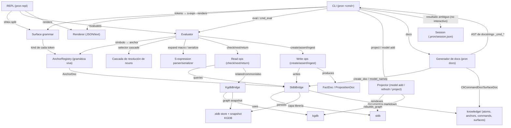
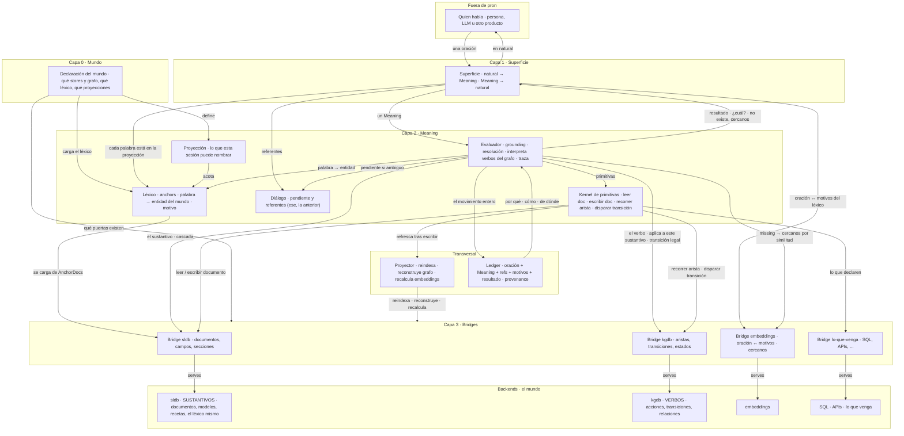
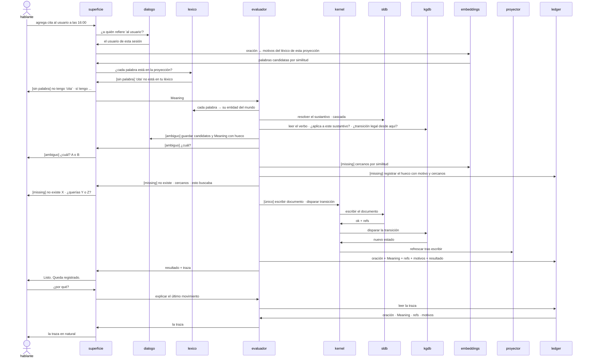
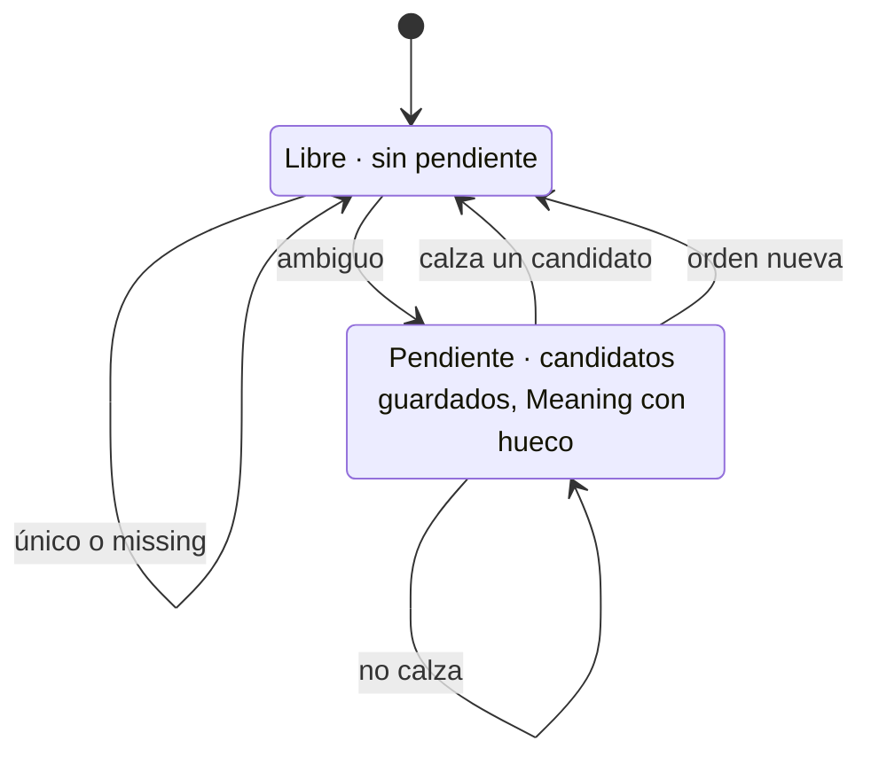

# Arquitectura de pron

Actual: derivado del código. Objetivo: el SHRDLU sobre el mundo — sustantivos en sldb, verbos en kgdb, el léxico como puente. La diferencia entre ambos es la lista de trabajo.

## Arquitectura actual

CLI/REPL sobre un kernel de Meaning (s-expresiones ancladas por gramática viva), operaciones que despachan a los bridges — la única puerta a sldb y kgdb — y un generador de docs que deriva del propio código.

- CLI y REPL comparten el mismo Evaluator; no hay una segunda gramática.
- Session (.pron/session.json) solo persiste la desambiguación del CLI no interactivo; el REPL la mantiene en memoria.
- Los bridges (SldbBridge, KgdbBridge) son la única puerta a las librerías sldb/kgdb, por atom-bridges-are-the-only-doors-to-sldb-and-kgdb.
- El generador de docs (pron docs) deriva CliCommandDoc de los docstrings de los handlers _cmd_* y SurfaceDoc del AST de cada módulo público.

## Objetivo · componentes

Un SHRDLU montado sobre el mundo tal como los dos stores lo reparten. Sustantivos en sldb (documentos, modelos, recetas, el léxico mismo). Verbos en kgdb (acciones, transiciones, relaciones). Pron no tiene operaciones — las lee del grafo y las interpreta — y lo único que es código es un kernel de cuatro primitivas.

- Los anchors son el léxico. Nombran cosas que ya existen en el mundo, por proyección, con un motivo. No declaran operaciones ni contienen semántica. Su kind se deriva de a qué apuntan — modelo = sustantivo, arista/transición/acción = verbo.
- Lo que un operador puede decir es lo que puede hacer. Una entidad del grafo sin anchor en tu proyección es invisible desde la superficie.
- La pregunta qué puedo hacer con un paso la responde el grafo — las aristas, transiciones y acciones incidentes a ese tipo — y el léxico lo traduce a palabras.
- La superficie traduce comparando la oración con los motivos del léxico (embeddings). Un missing ofrece cercanos por similitud, no solo por texto. Qué pasa después con el hueco no es de pron.
- Las recetas (contexto, seguridad) son documentos del mundo. El anchor solo las nombra.
- El _dispatch con seis verbos fijos en Python es lo que desaparece: los verbos se declaran en kgdb.

## Objetivo · un turno

Desde que entra una oración hasta que sale una respuesta en natural. La superficie compara la oración con los motivos del léxico; el evaluador resuelve el sustantivo en sldb y lee el verbo en kgdb; las tres salidas del grounding — único, ambiguo, missing — y el "¿por qué?" que lee el ledger.

- Los referentes (al usuario, ese, la anterior) se resuelven en el diálogo antes de groundear.
- Sin palabra en la proyección, la oración vuelve desde la superficie sin llegar al evaluador.
- Leer el verbo en kgdb incluye si aplica a este sustantivo y si la transición es legal desde el estado actual.
- Ambiguo abre una pendiente; la próxima oración entra como respuesta. Missing consulta embeddings, registra el hueco y termina el turno.
- El kernel solo ejecuta primitivas; el proyector refresca solo después de una escritura.

## Objetivo · el diálogo

El único estado propio de pron por sesión — si hay o no una pregunta pendiente — y sus cuatro salidas.

- Es la conversación estilo SHRDLU. Una ambigüedad abre una pregunta; la siguiente oración la contesta, no la contesta, o la descarta.
- Todos los movimientos se registran, incluidos los que no cambian de estado.

