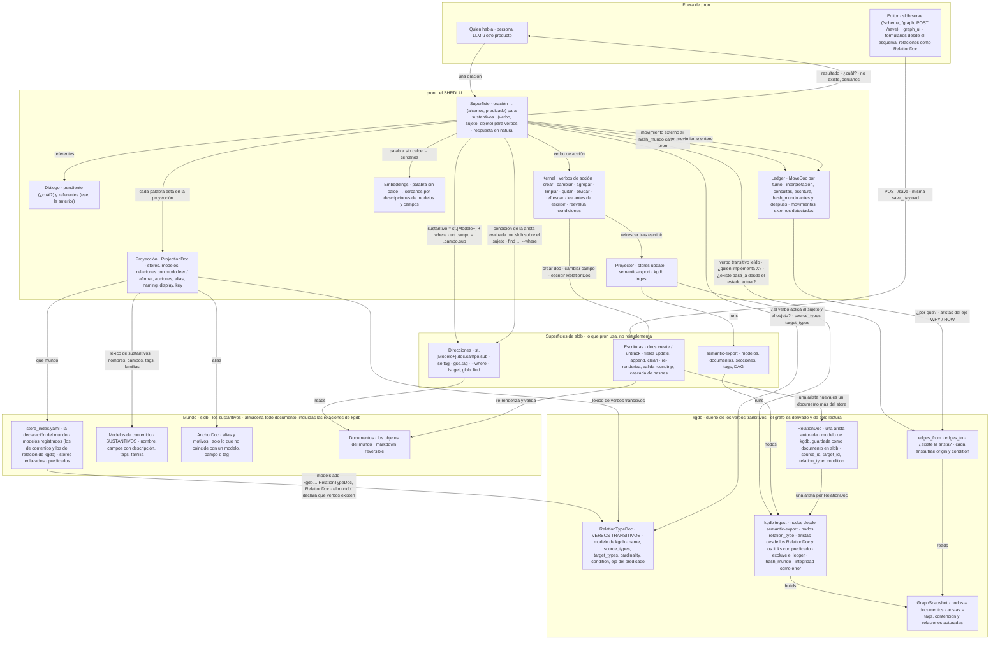
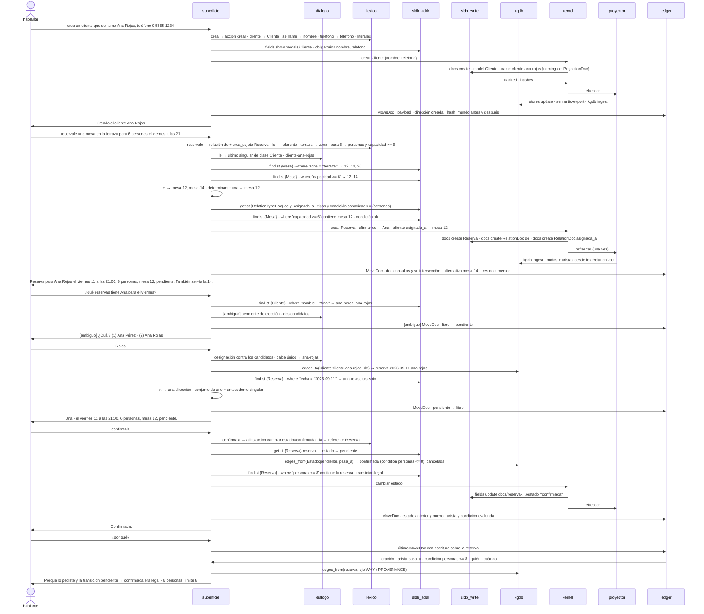
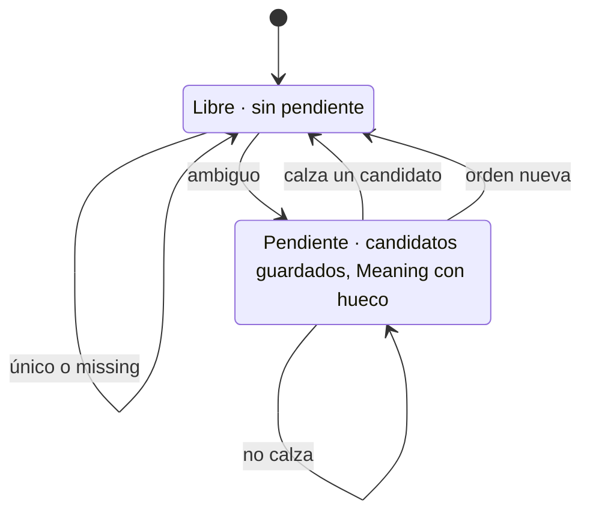

# Arquitectura de pron

La arquitectura objetivo de pron, proyección gráfica de source/spec. Sustantivos por dirección en sldb, verbos transitivos como modelos de relación de kgdb almacenados en sldb y ensamblados por su ingest, verbos de acción como escrituras de sldb. La v1 está en la rama v1-code-and-kb.

## Objetivo · componentes

Pron pide por dirección, recorre aristas y escribe documentos. No resuelve, no filtra, no declara verbos. Los sustantivos son st.{Modelo+}.doc.campo más un predicado; los verbos transitivos son los modelos de relación de kgdb (RelationTypeDoc, RelationDoc), que sldb almacena como documentos y el ingest de kgdb ensambla; los verbos de acción son docs create, fields update y refrescar.

- El léxico sale de los modelos: nombre, campos con descripción, tags, familias ({Modelo+}). Los RelationTypeDoc dan los verbos transitivos con sus tipos válidos. Los AnchorDoc son alias, no la fuente.
- Un sustantivo es una dirección más un predicado, y eso lo responde sldb (ls, get, glob, find, --where). Pron no tiene cascada de resolución propia.
- Los modelos de relación son de kgdb: RelationTypeDoc declara el verbo con sus tipos válidos y su eje, RelationDoc es una arista autorada. Pron los registra en su store al declarar el mundo; sldb los guarda como documentos; el ingest de kgdb los vuelve aristas. kgdb sigue siendo derivado y de solo lectura.
- El editor (sldb serve + graph_ui) escribe por la misma save_payload que pron. pron detecta lo que no hizo comparando hash_mundo y hash_d, recarga léxico y registra un movimiento externo.
- Las condiciones viven en el RelationTypeDoc (para todas sus aristas) o en un RelationDoc (que reemplaza la del tipo), y las evalúa sldb sobre el sujeto con find --where; pron solo las pasa.
- Una transición no se dispara en kgdb. Es una escritura en sldb, arista más campo de estado, seguida de un refresh que reensambla el grafo.
- El kernel son los verbos de acción y cada uno es una operación de sldb que ya existe: docs create, fields update y append, docs untrack, stores update.
- La declaración del mundo es store_index.yaml: modelos registrados, stores enlazados, predicados. La proyección es la parte de eso que una sesión puede nombrar.
- El por qué se lee de las aristas del eje WHY, HOW y PROVENANCE que los predicados del store le dan a cada verbo, más el ledger.
- Los sustantivos del mundo de pron son sus propios modelos: átomo, comando, superficie, anchor. Hoy los átomos están tipados con el AtomDoc de deskops y hay trece modelos de deskops registrados sin documentos; los dos salen, deskops es otra instancia sobre el núcleo, no la fuente de los modelos de pron.
- El kgdb ingest unificado (nodos, nodos relation_type, aristas desde RelationDoc y links, ledger excluido, hash_mundo, integridad como error) es el prerrequisito de source/spec/08; hoy sus dos mitades existen por separado.

## Objetivo · una conversación

Cinco turnos de source/spec/09 sobre el mundo del restaurante (09a): crear con payload, un verbo transitivo que crea su sujeto con dos predicados cruzados, una ambigüedad y su respuesta, una transición guardada por pasa_a y una condición evaluada por sldb, y el por qué.

- Cada mensaje es la llamada real de sldb o kgdb; correrlas en la shell da el mismo resultado que el turno.
- Dos restricciones son dos consultas y una intersección de direcciones; también cuando una lista viene de kgdb (edges_to) y otra de sldb (find).
- Verificar que el verbo aplica es leer source_types y target_types del RelationTypeDoc de kgdb, por dirección en sldb. Verificar que la arista existe es kgdb. Verificar la condición es sldb, con find --where sobre el sujeto.
- Afirmar un verbo transitivo es docs create de un RelationDoc; si el sujeto no existe, se crea en el mismo movimiento. kgdb nunca recibe una orden: su ingest reensambla.
- Una transición es cambiar el campo estado, permitida porque existe pasa_a desde el estado actual y su condición se cumple. No crea aristas.
- Una pendiente de elección se contesta con una designación contra los candidatos ya mostrados; un conjunto de exactamente uno vale como antecedente singular.
- El MoveDoc se escribe después del refresh y no lo desfasa: el ledger queda fuera de hash_mundo y del grafo.
- El mundo del restaurante está declarado entero en source/spec/09a: modelos, tipos de relación con su condición, transiciones, ProjectionDoc y alias.

## Objetivo · el diálogo

El único estado propio de pron por sesión — si hay o no una pregunta pendiente — y sus cuatro salidas.

- Es la conversación estilo SHRDLU. Una ambigüedad abre una pregunta; la siguiente oración la contesta, no la contesta, o la descarta.
- Todos los movimientos se registran, incluidos los que no cambian de estado.

