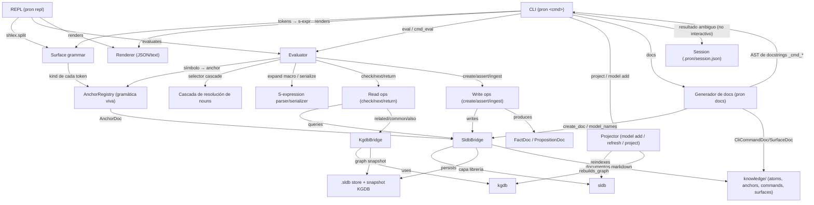
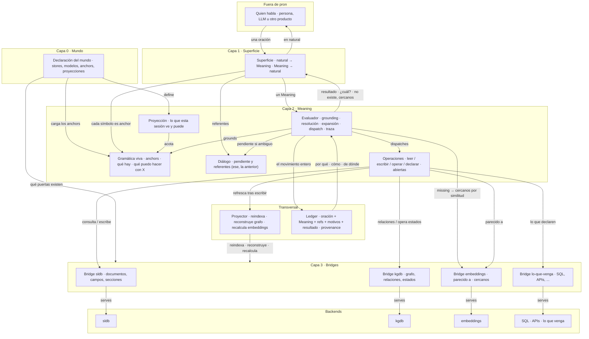
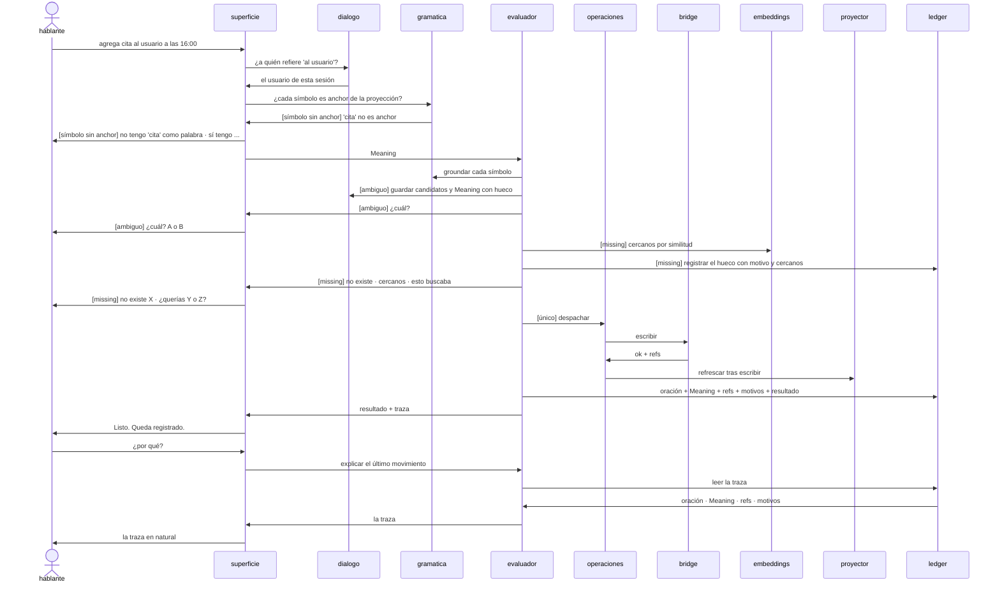
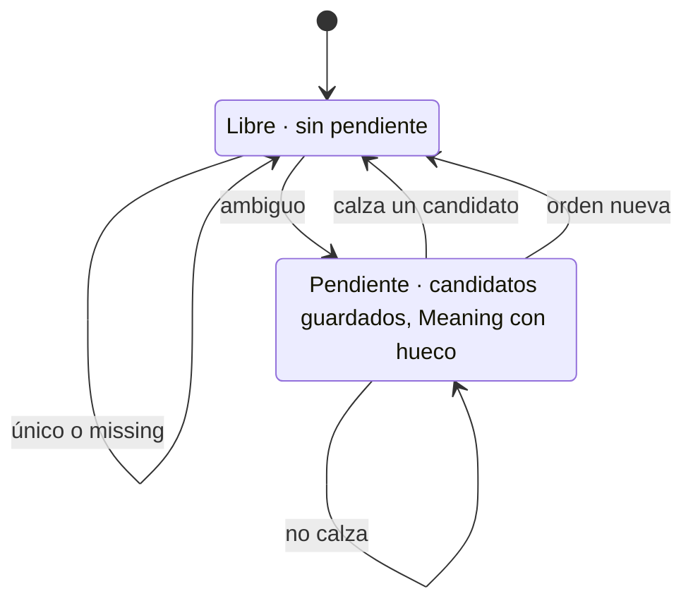

# Arquitectura de pron

Actual: derivado del código. Objetivo: el SHRDLU sobre un mundo declarado. La diferencia entre ambos es la lista de trabajo.

## Arquitectura actual

CLI/REPL sobre un kernel de Meaning (s-expresiones ancladas por gramática viva), operaciones que despachan a los bridges — la única puerta a sldb y kgdb — y un generador de docs que deriva del propio código.

- CLI y REPL comparten el mismo Evaluator; no hay una segunda gramática.
- Session (.pron/session.json) solo persiste la desambiguación del CLI no interactivo; el REPL la mantiene en memoria.
- Los bridges (SldbBridge, KgdbBridge) son la única puerta a las librerías sldb/kgdb, por atom-bridges-are-the-only-doors-to-sldb-and-kgdb.
- El generador de docs (pron docs) deriva CliCommandDoc de los docstrings de los handlers _cmd_* y SurfaceDoc del AST de cada módulo público.

## Objetivo · componentes

Un SHRDLU sobre un mundo declarado. Quien habla es un solo actor externo; una única superficie natural ↔ Meaning; evaluador que grounda contra la gramática viva acotada por la proyección; operaciones abiertas; una puerta por backend; ledger transversal.

- El vocabulario base no tiene palabras de dominio. Las de dominio (regla, paso, herramienta) se declaran por mundo como anchors.
- Un símbolo que no es anchor de la proyección vuelve como pregunta desde la superficie; nunca llega al evaluador.
- Un missing usa el bridge de embeddings para ofrecer cercanos por similitud, no solo por texto. Qué pasa después con el hueco no es de pron.
- El ledger guarda por movimiento la oración, su Meaning, los refs y los motivos. "¿Por qué?" lo lee. La traducción puede ser difusa porque el grounding es estricto.

## Objetivo · un turno

Desde que entra una oración hasta que sale una respuesta en natural, con las tres salidas del grounding — único, ambiguo, missing — y el "¿por qué?" que lee el ledger.

- Los referentes (al usuario, ese, la anterior) se resuelven en el diálogo antes de groundear.
- Ambiguo abre una pendiente; la próxima oración entra como respuesta.
- Missing consulta embeddings para cercanos, registra el hueco y termina el turno.
- El proyector refresca solo después de una escritura.

## Objetivo · el diálogo

El único estado propio de pron por sesión — si hay o no una pregunta pendiente — y sus cuatro salidas.

- Es la conversación estilo SHRDLU. Una ambigüedad abre una pregunta; la siguiente oración la contesta, no la contesta, o la descarta.
- Todos los movimientos se registran, incluidos los que no cambian de estado.

